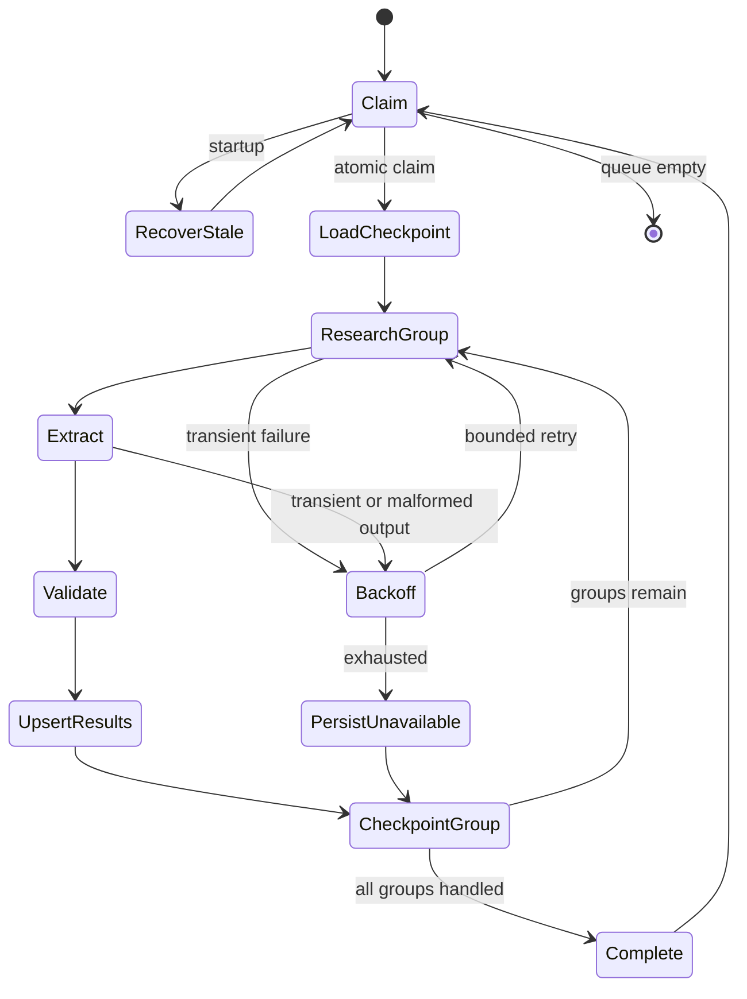

# Architecture

## Scope and operating modes

The project is one unattended worker architecture with two interchangeable tool/extractor pairs:

- `fixture`: deterministic replay from small authored records, with no network or paid model.
- `live`: HTTP collection from a user-imported official company domain plus schema-constrained
  extraction through an OpenAI-compatible Chat Completions endpoint.

The fixture path proves orchestration and reliability behavior. It does not prove current web
accuracy or a particular model provider's behavior. The live path is implemented but remains
unverified without credentials.

## Execution loop

One company-local uncaught exception marks only that job failed. The outer loop immediately claims
the next job.

## Queue and transactions

Tables are `companies`, `jobs`, `field_results`, and `runs`.

- `jobs.company_id` is unique, so importing the same company does not create a second job.
- `field_results(company_id, field_name)` is unique.
- PostgreSQL claims the oldest pending job inside a transaction with
  `FOR UPDATE SKIP LOCKED`.
- SQLite uses one atomic `UPDATE` against an ordered scalar subquery with `RETURNING`; WAL and a
  busy timeout support the deterministic local/concurrency tests.
- A claim assigns `worker_id`, `run_id`, increments attempts, and sets `lease_until`.
- Checkpoint and field upserts commit together at each group boundary.

SQLite is the zero-dependency replay backend. PostgreSQL is the intended multi-worker backend;
the container configuration is provided, but this workstation had no Docker engine, so a live
PostgreSQL integration run was not claimed as verified.

## Grouped source strategy

Fifteen fields are split into identity, leadership, organization, commercial, and public-presence
groups. One source collection can support multiple related fields.

This avoids two weak extremes:

- One giant call has a large failure boundary, weak source affinity, and expensive replays.
- One call per field repeats retrieval and multiplies latency and provider cost.

Group commits provide a useful resume unit: small enough to replay cheaply and large enough to
reuse evidence.

## Validation and citations

`GroupResult` and `FieldResult` are Pydantic models with `extra="forbid"`. Validation enforces:

- exact group membership with no missing or duplicate fields;
- a fixed field-name allowlist and fixed statuses;
- URL parsing and typed timestamps;
- nonempty values and source URLs for every `found` result;
- no value or source URL on unavailable results.

The live extractor additionally rejects any model citation that was not supplied by the research
tool. Invalid model output never reaches `field_results`.

## Retry and failure boundaries

Retryable HTTP/model failures use bounded exponential backoff with jitter. Permanent source errors
are not retried. Exhausted source collection records `source_unreachable`; exhausted extraction or
validation records `validation_failed`. Either condition is checkpointed so unrelated groups and
companies continue.

## Idempotency and recovery

Field writes are dialect-native upserts on `(company_id, field_name)`. Replaying a group updates its
stable rows rather than appending duplicates. The checkpoint contains completed group names. An
expired running lease is atomically returned to pending; a new claim increments attempts and skips
already committed groups.

## Observability

JSON Lines events include timestamps plus `run_id`, `worker_id`, `company_id`, `job_id`, group,
attempt, status, elapsed time, retry delay, and error category when relevant. Database summaries
report job/field counts, retries, validation failures, recoveries, claims, and unique result rows.
No secret is included in event construction.

